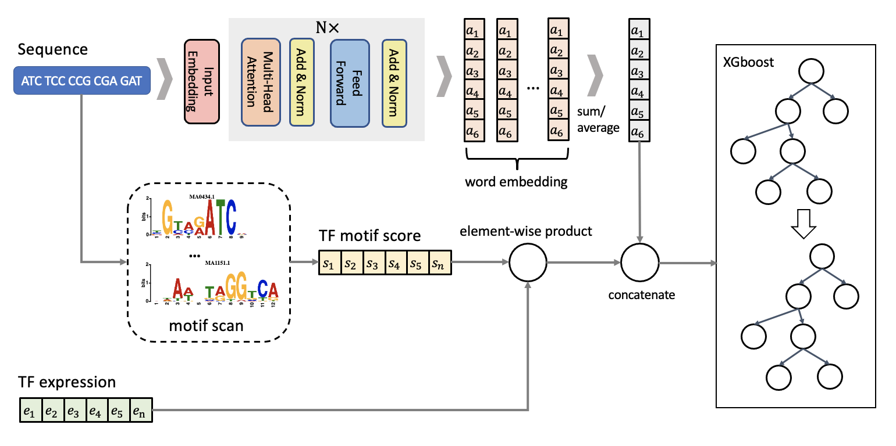

# KmerTR

# 本科毕业设计项目

#### A classification model of gene regulatory elements based on Transformer and XGboost.


Cis-regulatory elements are DNA sequences that regulate gene expression and are mostly located in non-coding regions of the genome. In recent years, researches on gene regulatory elements have focused on promoters and enhancers, but less on silencers and other elements. Although some databases have collected and provided plenty of promoters and enhancers, there are few experimentally validated data on silencers, which limits the further understanding of the regulatory mechanisms of these regulatory elements. Besides, computational methods on predicting regulatory elements are still stuck in black box models, which are lack of interpretability. 

we proposed a classification model named KmerTR based on multi-omics data and genome-wide pretraining. KmerTR treats DNA sequences as special natural language, and applies the encoder of the seq2seq model named Transformer to omics data.

<div align=center>

</div>   

## Installation  

```  
Requiements:  
1. Python 3.6.10 or later version  
2. Packages:  
    numpy (1.19.5)  
    scikit-learn (0.22.1)
    xgboost (1.2.1)
  
Package installation:
  
$ pip install -U numpy  
$ pip install scikit-learn == 0.22.1
$ pip install -U xgboost 
$ conda install pytorch torchvision torchaudio cudatoolkit=X.X -c pytorch
$ git clone https://github.com/ZjGaothu/KmerTR.git   
$ cd KmerTR
```
